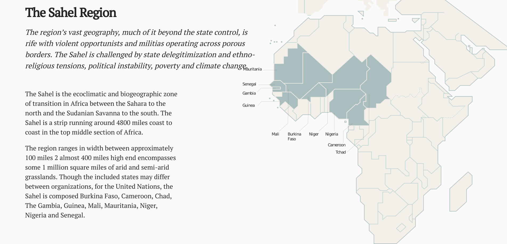
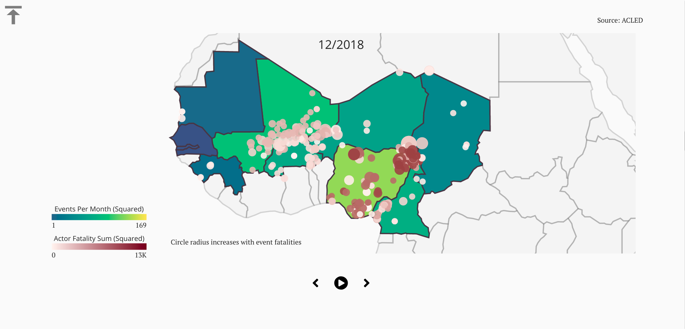
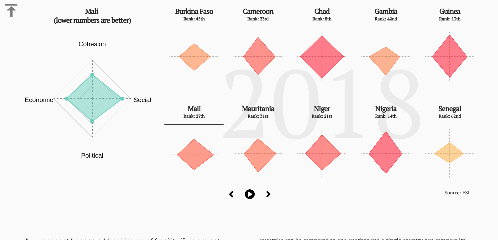

# How Fragile is the Sahel?
## An analytical perspective on fragility and its indicators.

### URL
https://wolfm2.github.io/thesis/Sahel/

### Abstract
The Sahel region in northern Africa is a  place where the member countries are joined by conflict and depravations.   While it has historically been largely arid and difficult area in which to survive, the situation has worsened manifold since the region experienced its worst drought for decades in 2010.  This drought which has stressed governmental services as it has allowed a new sort of terrorism to flourish.  The UN has organized several missions in the region in hopes of stabilizing the situation but has often met with limited success.  This work will focus on examining what it means when a state is defined by multilateral organizations as being fragile. The rehetoric will be understood through indicators measuring climate change, the activities of al-Qaida, Boko Haram, the Islamic State, and other violent actors in the region via the ACLED dataset, and the degradaton of trust in public services and other political instabilities each of these have engendered.

This will be followed by an overview of the UN's response to fragility framed by the Sustainable Development Goals, and an interactive look at how they inform their regional policy via a UN curated set of SDG metrics.  

In what ways will the turmoil in the Sahel affect all of us?  What is state fragility?  How does the UN measure it?  What initiatives have they created as a response to these challenges?  Can they measure their progress effectively?

### Screenshots

### Acknowledgements
Many thanks to my partner and Pauline Gourlet.  Both helped immeasurably in the production of this work.
